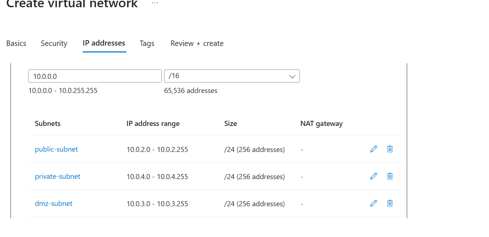
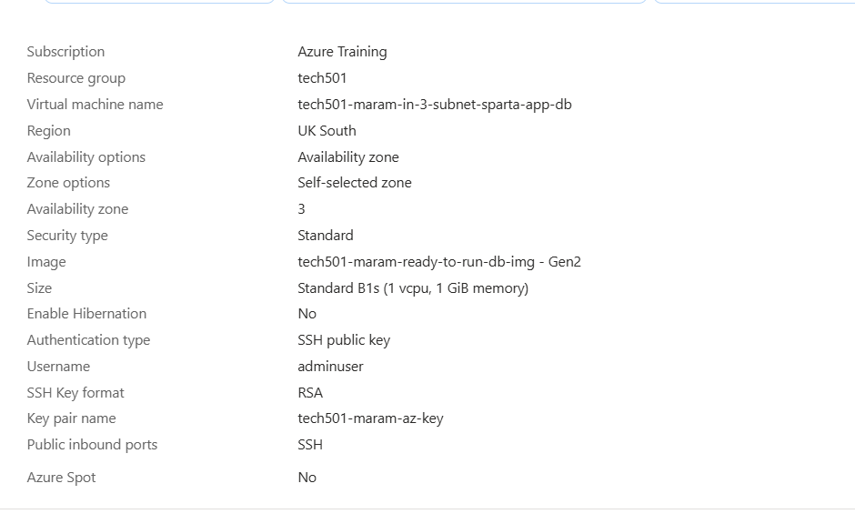
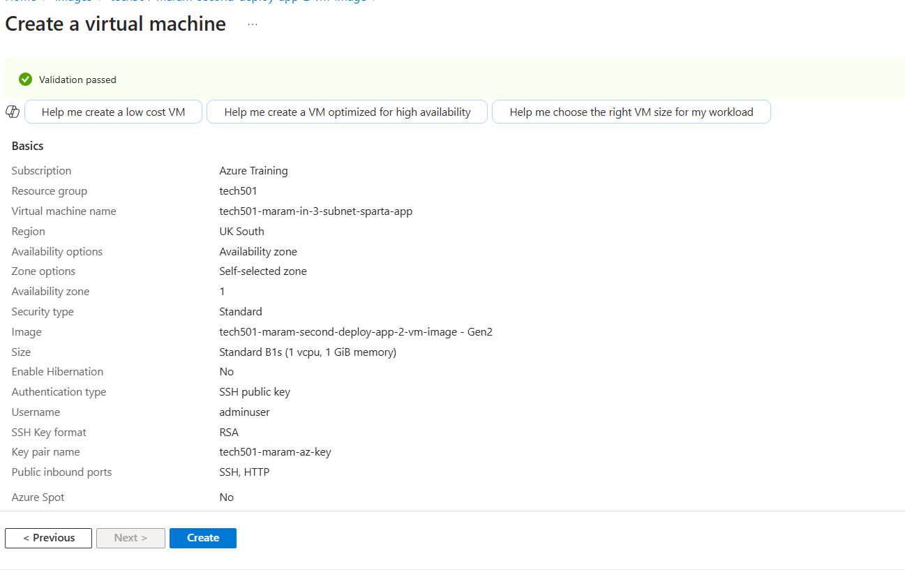
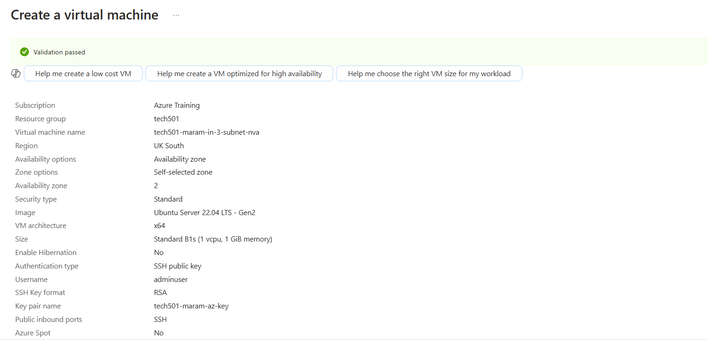
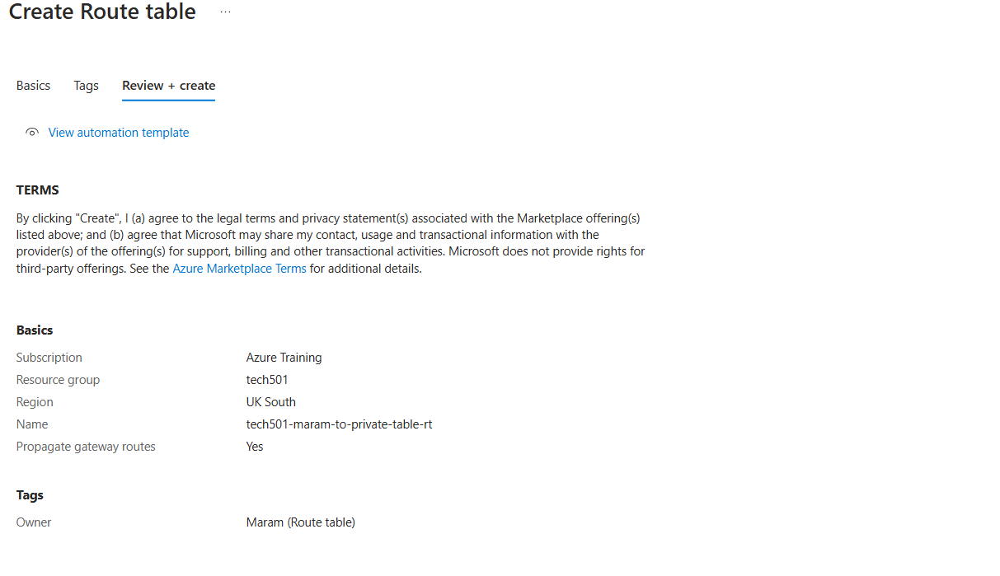
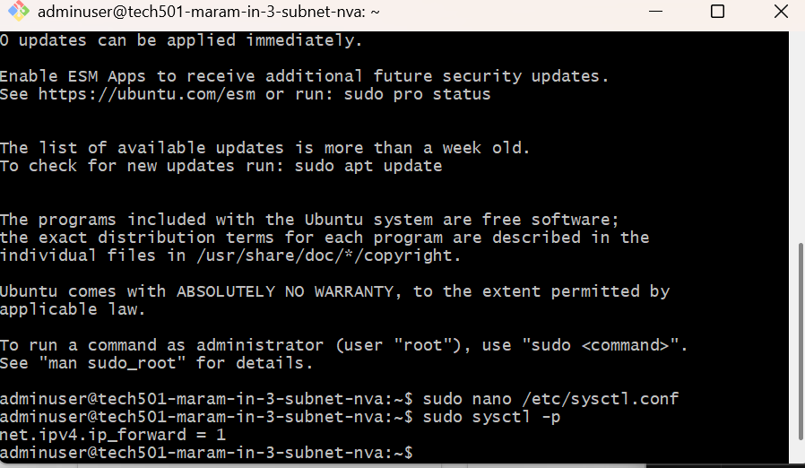
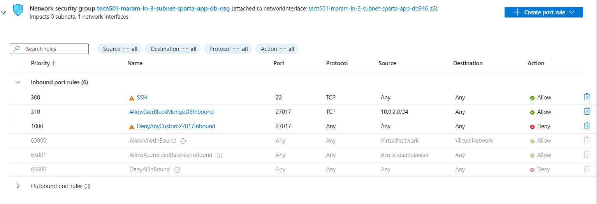

# Securing Databases using a 3-subnet architecture:
- A 3-subnet architecture using a DMZ (Demilitarized Zone) subnet and an NVA (Firewall) adds additional security layers by controlling traffic between external users, applications, and the database.

## Creating a 3-Subnet Architecture to Secure the Database  


## Step 1: Create the Virtual Network (VNet)

### 🔹 Create the VNet `tech501-maram-3-subnet-vnet`

1. Go to **Azure Portal** → **Virtual Networks** → **Create a virtual network**.
2. On the **Basics** tab, configure the following:
   - **Resource Group:** tech501
   - **Name:** `tech501-maram-3-subnet-vnet`
   - **Region:** UK South

3. Click **Next: IP Addresses**.


---

### 🔹 Configure Subnets

4. Under the **IP Addresses** tab:
   - **IPv4 Address Space:** `10.0.0.0/16`

5. Click **+ Add Subnet** and configure the following:
   - **Name:** `Private Subnet`
   - **Subnet Address Range:** `10.0.4.0/24`
   - Enable Private subnet

6. Click **+ Add Subnet** and configure the following:
   - **Name:** `Public Subnet`
   - **Subnet Address Range:** `10.0.2.0/24`

7. Click **+ Add Subnet** and configure the following:
   - **Name:** `dmz-Subnet`
   - **Subnet Address Range:** `10.0.3.0/24`




8. Click **Next: Security** and configure as needed.
9. Click **Next: Tags** and add:
   - **Owner:** `Maram`
10. Click **Review + Create** ✅

## step 2: Create the Database VM  

### 🔹 Use the "tech501-maram-ready-to-run-db-img" Image  

1. Go to **Azure Portal** → **Create a Virtual Machine**.  
2. On the **Basics** tab, configure the following:  
   - **Name:** `tech501-maram-in-3-subnet-sparta-app-db`  
   - **Availability Zone:** `Zone 3`  
   - **Username:** `adminuser`  
   - **SSH:** Use **existing key**  
   - **Inbound Ports:** Allow **SSH (22) only**  
   - **License Type:** `Other`  
   - **OS Disk Type:** `Standard SSD`  
   - ✅ Tick **"Delete with VM"**  

### 🔹 Configure Networking  

3. Under the **Networking** tab, set:  
   - **Virtual Network (VNet):** `tech501-maram-3-subnet-vnet`  
   - **Subnet:** `Private Subnet (10.0.4.0/24)`  
   - **Public IP:** `None`  
   - ✅ Tick **"Delete NIC when VM is deleted"**  

4. Add the following **Tags**:  
   - **Owner:** `Maram`  

5. Click **Review and Create** ✅ 

 

---

## Step 3: Create the Application VM  

### 🔹 Use the "tech501-maram-second-deploy-app-vm-img" Image  

1. Go to **Azure Portal** → **Create a Virtual Machine**.  
2. On the **Basics** tab, configure the following:  
   - **Name:** `tech501-maram-in-3-subnet-sparta-app`  
   - **Availability Zone:** `Zone 1`  
   - **Username:** `adminuser`  
   - **SSH:** Use **existing key**  
   - **Inbound Ports:** Allow **HTTP (80)**  
   - **License Type:** `Other`  
   - **OS Disk Type:** `Standard SSD`  
   - ✅ Tick **"Delete with VM"**  

3. Under the **Networking** tab, set:  
   - **Virtual Network (VNet):** `tech501-maram-3-subnet-vnet`  
   - **Subnet:** `Public Subnet (10.0.2.0/24)`  
   - **Public IP:** `tech501-maram-public-ip`  
   - ✅ Tick **"Delete NIC when VM is deleted"**  

4. Under the **Advanced** tab, enable **User Data** and add the following script:  

   ```bash
   #!/bin/bash
   cd /app
   export DB_HOST=mongodb://10.0.4.4:27017/posts  # Always check if DB private IP needs to be updated
   pm2 start app.js

4. Add the following **Tags**:  
   - **Owner:** `Maram`  

5. Click **Review and Create** ✅ 




---

## 🔹 Verification Steps  

1. **SSH into the App VM**  
   ```bash
   ssh -i <your-private-key.pem> adminuser@<app-vm-public-ip>
2. **Ping the Database VM to check connectivity**
   ```bash
   ping 10.0.4.4

1. Check if the application is running
    ```bash
    http://http://20.90.209.188/posts


## Step 4: Create the NVA (Network Virtual Appliance) VM
  

1. Go to **Azure Portal** → **Create a Virtual Machine**.  
2. On the **Basics** tab, configure the following:  
   - **Name:** `tech501-maram-in-3-subnet-nva`  
   - **Availability Zone:** `Zone 2`  
   - **Username:** `adminuser`  
   - **SSH:** Use **existing key**  
   - **Inbound Ports:** Allow **SSH (22) only**  
   - **License Type:** `Other`  
   - **OS Disk Type:** `Standard SSD`  
   - ✅ Tick **"Delete with VM"**  
3. Under the **Networking** tab, set:  
   - **Virtual Network (VNet):** `tech501-maram-3-subnet-vnet`  
   - **Subnet:** `dmz-Subnet (10.0.3.0/24)`  
   - **Public IP:** `None`  
   - ✅ Tick **"Delete NIC when VM is deleted"**  

4. Add the following **Tags**:  
   - **Owner:** `Maram`  
5. Click **Review and Create** ✅




<br>


## Step 5: Create the Route Table and Add Routes

### 1. Create the Route Table
- Under **Route Tables**, click **Create route table**.
- Name the route table as `tech501-maram-to-private-table-rt`.
- Click **Create** to create the route table.





### 2. Add a Route to the Table
- After the route table is created, select it from the list of **Route Tables**.
- Go to the **Routes** tab and click **Edit routes**.
- Click **Add route** and configure the following:
  - **Destination**: `10.0.4.0/24`
  - **Target**: **Virtual appliance**
  - **Virtual appliance IP**: `10.0.3.4`
- Click **Save routes**.


### 3. Associate the Route Table with Subnets
- Go to the **Subnet Associations** tab in the route table.
- Click **Edit subnet associations**.
- Select the following subnets to associate with the route table:
  - **tech501-maram-3-subnet-vnet** (from the VPC **tech501**)
  - **public-subnet**
- Click **Save**.


This ensures that the route table `tech501-maram-to-private-table-rt` is associated with the selected subnets, and traffic from `10.0.4.0/24` will be routed through the virtual appliance at `10.0.3.4`.

---

## Step 6: Enabling IP Forwarding on NVA in Azure

### Why Enable IP Forwarding?

IP forwarding is essential on a Network Virtual Appliance (NVA) in Azure because it allows the NVA to route traffic between different networks, subnets, and VNets. By enabling IP forwarding, the NVA can act as a gateway, forwarding traffic to the appropriate destination. Without IP forwarding, the NVA cannot route traffic, causing network communication failures between connected networks.

### Steps to Enable IP Forwarding on the NVA in Azure

1. **Go to the Azure Portal**:
   - Open the [Azure Portal](https://portal.azure.com).

2. **Find the Network Interface**:
   - Navigate to the **Virtual Machines** section and select the NVA (Network Virtual Appliance).
   - Under **Networking**, find the **Network Interface** associated with the NVA.

3. **Enable IP Forwarding**:
   - In the **Network Interface** settings, click on **IP configurations**.
   - Select the IP configuration that corresponds to the interface on which you want to enable IP forwarding.
   - Toggle **IP Forwarding** to **Enabled**.
   - Click **Save** to apply the changes.


---

## Enabling IP Forwarding on a Linux NVA via SSH

### 1. SSH into the NVA

ssh username@NVA_IP_address

### 2. Enable IP Forwarding on the Linux NVA

Once logged in, follow these steps to enable IP forwarding:

1. **Open the sysctl configuration file**:
   ```bash
   sudo nano /etc/sysctl.conf
Find the following line:

#net.ipv4.ip_forward=1

2.Uncomment the line (remove the #) :
```bash
net.ipv4.ip_forward=1
```

3. Apply the Changes
To apply the changes immediately, run the following command:

```bash
sudo sysctl -p
```
* after reloading the ping should be back to work



----

## Step 7: Creating Iptables Rules

### 1. Create a Bash Script to Automate Iptables Configuration

- IP tables would allow the incoming traffic to the NVA VM to be filtered based on the rules set. 
To automate the configuration of `iptables`, create a bash script called `config-ip-tables.sh`:
```bash
nano config-ip-tables.sh
```

1. Add the Following Content to the Script
```bash
#!/bin/bash

### configure iptables

echo "Configuring iptables..."

# Allow traffic on the loopback interface (localhost communication)
sudo iptables -A INPUT -i lo -j ACCEPT
sudo iptables -A OUTPUT -o lo -j ACCEPT

# Allow established and related connections
sudo iptables -A INPUT -m state --state ESTABLISHED,RELATED -j ACCEPT

# Allow established connections on the output side
sudo iptables -A OUTPUT -m state --state ESTABLISHED -j ACCEPT

# Drop invalid packets
sudo iptables -A INPUT -m state --state INVALID -j DROP

# Allow SSH (port 22) traffic for new and established connections
sudo iptables -A INPUT -p tcp --dport 22 -m state --state NEW,ESTABLISHED -j ACCEPT
sudo iptables -A OUTPUT -p tcp --sport 22 -m state --state ESTABLISHED -j ACCEPT

# Uncomment these lines to allow SSH into NVA only through the public subnet (app VM as a jumpbox)
# sudo iptables -A INPUT -p tcp -s 10.0.2.0/24 --dport 22 -m state --state NEW,ESTABLISHED -j ACCEPT
# sudo iptables -A OUTPUT -p tcp --sport 22 -m state --state ESTABLISHED -j ACCEPT

# Uncomment these lines to allow SSH to other servers using NVA as a jumpbox (outgoing SSH connections)
# sudo iptables -A OUTPUT -p tcp --dport 22 -m conntrack --ctstate NEW,ESTABLISHED -j ACCEPT
# sudo iptables -A INPUT -p tcp --sport 22 -m conntrack --ctstate ESTABLISHED -j ACCEPT

# Allow specific traffic from app VM to db VM (MongoDB traffic on port 27017)
sudo iptables -A FORWARD -p tcp -s 10.0.2.0/24 -d 10.0.4.0/24 --destination-port 27017 -m tcp -j ACCEPT

# Allow ICMP traffic between app VM and db VM
sudo iptables -A FORWARD -p icmp -s 10.0.2.0/24 -d 10.0.4.0/24 -m state --state NEW,ESTABLISHED -j ACCEPT

# Drop all other incoming traffic
sudo iptables -P INPUT DROP

# Drop all other forwarded traffic
sudo iptables -P FORWARD DROP

echo "Done!"
echo ""

# Make iptables rules persistent
# This will ask for user input by default
echo "Make iptables rules persistent..."
sudo DEBIAN_FRONTEND=noninteractive apt install iptables-persistent -y
echo "Done!"
echo ""


Here is the complete markdown guide for creating iptables rules and running the bash script to automate the configuration:

# Creating Iptables Rules

These rules restrict traffic so that only the right traffic from the app VM can reach the db VM.

### 1. Create a Bash Script to Automate Iptables Configuration

To automate the configuration of `iptables`, create a bash script called `config-ip-tables.sh`:

nano config-ip-tables.sh
2. Add the Following Content to the Script
#!/bin/bash

# configure iptables

echo "Configuring iptables..."

# Allow traffic on the loopback interface (localhost communication)
sudo iptables -A INPUT -i lo -j ACCEPT
sudo iptables -A OUTPUT -o lo -j ACCEPT

# Allow established and related connections
sudo iptables -A INPUT -m state --state ESTABLISHED,RELATED -j ACCEPT

# Allow established connections on the output side
sudo iptables -A OUTPUT -m state --state ESTABLISHED -j ACCEPT

# Drop invalid packets
sudo iptables -A INPUT -m state --state INVALID -j DROP

# Allow SSH (port 22) traffic for new and established connections
sudo iptables -A INPUT -p tcp --dport 22 -m state --state NEW,ESTABLISHED -j ACCEPT
sudo iptables -A OUTPUT -p tcp --sport 22 -m state --state ESTABLISHED -j ACCEPT

# Uncomment these lines to allow SSH into NVA only through the public subnet (app VM as a jumpbox)
# sudo iptables -A INPUT -p tcp -s 10.0.2.0/24 --dport 22 -m state --state NEW,ESTABLISHED -j ACCEPT
# sudo iptables -A OUTPUT -p tcp --sport 22 -m state --state ESTABLISHED -j ACCEPT

# Uncomment these lines to allow SSH to other servers using NVA as a jumpbox (outgoing SSH connections)
# sudo iptables -A OUTPUT -p tcp --dport 22 -m conntrack --ctstate NEW,ESTABLISHED -j ACCEPT
# sudo iptables -A INPUT -p tcp --sport 22 -m conntrack --ctstate ESTABLISHED -j ACCEPT

# Allow specific traffic from app VM to db VM (MongoDB traffic on port 27017)
sudo iptables -A FORWARD -p tcp -s 10.0.2.0/24 -d 10.0.4.0/24 --destination-port 27017 -m tcp -j ACCEPT

# Allow ICMP traffic between app VM and db VM
sudo iptables -A FORWARD -p icmp -s 10.0.2.0/24 -d 10.0.4.0/24 -m state --state NEW,ESTABLISHED -j ACCEPT

# Drop all other incoming traffic
sudo iptables -P INPUT DROP

# Drop all other forwarded traffic
sudo iptables -P FORWARD DROP

echo "Done!"
echo ""

# Make iptables rules persistent
# This will ask for user input by default
echo "Make iptables rules persistent..."
sudo DEBIAN_FRONTEND=noninteractive apt install iptables-persistent -y
echo "Done!"
echo ""
```
# Script:

- Loopback Traffic: Ensures internal communication within the system (e.g., between services).
- Established and Related Connections: Ensures that once a connection is made, it is not blocked again.
- Invalid Packets: A security measure to reject malformed packets that could indicate attack attempts.
- SSH Access: Allows remote management of the server via SSH while ensuring only legitimate traffic is allowed.
- MongoDB and ICMP Traffic: Allows specific application traffic like MongoDB and ICMP (ping) for network communication between virtual machines.
- Block All Other Traffic: Ensures that anything not explicitly allowed by the rules is blocked, improving security.
- Persistent Rules: Installs the iptables-persistent package to make sure the rules persist across system reboots.


3. Change Permissions for the Script:
```bash
chmod +x config-ip-tables.sh
```

4. Run the Script:
```bash
 ./config-ip-tables.sh
```

## Step 8: Change database NSG

- Allow MongoDB traffic from the app VM:
  - IP Address: 10.0.2.0/24
  - Service: mongodb
  - Destination Port: 27017
- Deny all other traffic to ensure only allowed connections can reach the database.
  - Set the destination port ranges to * for more cover.
  - Set the rule number to 1000.
- Following the deny rules the ping should stop and will only work if we set a new rule allowing ping before the deny rule. 




